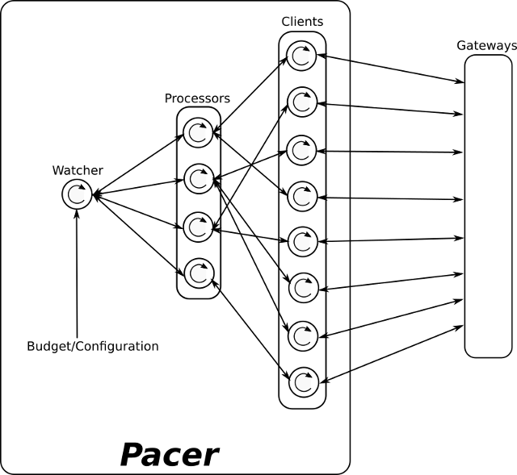

Copyright 2019(c) [Wael El Oraiby](https://twitter.com/weloraiby), All rights reserved.

**Disclaimer:** Opinions are my own.

I work at [Samsung Ads/Adgear](https://adgear.com/en/). It's an online Ads platform/Exchange. We sell Ads on the internet (Browser, Mobile, TVs...).

A typical pacer node (more on that later) in our system handles up to a Million request/s. One of the objectives was to make it scalable to multiple cores and network cards.

I thought to rewrite the pacer in F#/CoreCLR since it offers stronger guarantees: A strong type system, very reliable packages and most importantly an Async framework. The surprise was that the Async socket framework  that relies on CoreFX is very far behind on Linux in term of sheer throughput. The solution was to Marshal calls from F# to [libuv](https://libuv.org/) and achieve 5 Millions (at least) bid requests/s on 16 threads (this solution scales with cores/NICs).

***Warning:*** This is a war story...

# 5M bid request/s, 2ms Max Response Time - The Road to Damascus
In the worst case, we will have 5M bid requests a second (over 500k packets) hammering a single node, each has to be served in less than 2ms. Our node is a 40 (virtual) cores server with at least 2 Gigabit Ethernet cards running Linux. The system has to make fast decisions on whether it spends money or not to show an Ad. The bidding strategies have to be clear and hopefully bug free, otherwise a single node end up overspending and send the company bankrupt.

## Welcome to the Digital/Online Advertisement Business
When you fire your browser or open a mobile app or even your smart TV, an Ad space will send a request to an online advertisement platform like Samsung, Google, Facebook... Most likely, the advertisement platform will act as an exchange (although not necessarily), it will run an auction by fanning out the request to other advertisers and ask them to bid. The one who bid the most wins the space and put his Ad. On a side note, at Samsung Ads/Adgear, we run a [second-price auction](https://en.wikipedia.org/wiki/Generalized_second-price_auction)). In this case, the winner pays the second highest price.

Depending on how close your nodes are to the exchange, the time to decide is usually about 20ms with a 120ms for the round trip. Some, like Google will give you up to [300ms](https://developers.google.com/authorized-buyers/rtb/peer-guide).

Through its journey, an Ad bid request grows. It will go through different phases and filters each augmenting the amount of information it holds about you (have you been looking for a car lately?). On each hop within our system, a database or a microservice is queried. The databases are not ordinary SQL databases, but rather, custom tailored ones, built for low latency and high throughput. At the end of the journey, lies a special microservice: The Pacer.

## The Pacer
The pacer microservice is the governing police at the end of line. Its duty is to ensure no advertisement campaign goes overbudget **and** tries its best to spread the spending across the life-time of the campaign.

The strategies and the heuristics to spread the budget across time are outside the scope of this article. They range however from the very simple to the complicated (complicated and not complex). My focus will be the architecture and the underlying optimization work.

## Atomics will explode
The early Pacer was written in C, using the infamously complicated [libck](http://concurrencykit.org/) for [lock-free data structures](http://www.drdobbs.com/lock-free-data-structures/184401865). Lock-free data structures and algorithms, ensure that at least one thread can keep going. They rely on [atomic](https://software.intel.com/en-us/node/506090) operations for their functionalities, making them fun to think about and implement from scratch.

That being said, the architecture of the old code makes it highly susceptible to race conditions. On a bad day, some Ad campaigns misbehave on external state updates, making the use of libck, a ticking atomic bomb...

I have hardly seen a real excuse to use lock-free data structures, unless you are doing very low level [kernel](https://lwn.net/Articles/262464/) stuff, a concurrent renderer (Most of I have seen are over engineered and didn't really need it) or your own custom [VM](https://github.com/eloraiby/tcpm) infrastructure (Read that warning twice). To compare, both Erlang & Go don't use them, and both are highly concurrent.

Lock-free data structures and programs are tricky and very hard to debug. To get them right you often need formal proofs or tons of tests on different CPU architectures. If not, brace yourself for bugs when you try to run your program on a non x64 architecture or change compiler versions. For testing, ARM are great thanks to their weaker atomic memory model.

Most of other problems (including rendering) can be solved with careful benchmark guided architectures.

***Note*** One lockfree renderer I have seen was twice as slow than the original mutex-locked one. The reason was again poor architecture choice, and a sea of C++ boost templates.

## The irony of fate & state
The original pacer would accept a batch of bid requests, run the strategies and reply in less than 2ms. It could answer up to a 1M bid req/s (~100k packets). However, all this was done on a single core. While budget changes and configuration reload (that could happen every 5 minutes) was run in parallel and changes the state while the bidder was acessing it.

One of the strategies we were using was very susceptible to budget changes and their incoming order. With bit of bad luck and libck help, it would misbehave and causes overspending requiring manual intervention.

One of the major improvement was phasing out that strategy and make all the strategies stateless or at least less susceptible to instruction ordering. That almost eliminated incidence rate.

With continuous strategy addition, each new one was taking a long time. Each time, special considerations and tests have to be made for the lock-free part. It was clear that the code has reached its end of life and a new rewrite is necessary. A rewrite in a higher level language will make us more productive.

I needed a language that can guarantee that the answer is always the same, given the same input. This is very helpful for unit testing and debugging. That puts me on the functional road. I also need a strong type system will force the use of the right unit of measure. For instance bidding with cents instead of Dollars. And finally immutability is very handy when it comes to concurrency: You make sure, no body is messing with the state while another is using it.

Needing these stronger guarantees and a good support for pattern matching for heuristics, my choices where Rust, Haskell, OCaml and F#/CoreClr (scala? That's another story for another day).


## Fire the minions
My first attempt was to try rust for the rewrite. Rust is a good system language with the strong guarantees. After few months it became clear: The ecosystem is very far from being stable and usable. I love the language but I strongly dislike the ecosystem and the geological compilation time.

I like both Haskell and OCaml. Sadly Haskell emphasizes on laziness, making it hard to debug, and the lack of debugging for native generated code was a no go for both Haskell and OCaml (OCaml native debugger is still a [work in progress](https://github.com/ocaml/ocaml/pull/574)).

F# stands out because it's jitted, can offer a strong type system and the tooling is great (if you accept to work with Visual Studio Code). Units of measure proved useful when writing budget related code :)

### Actors and Messages
If you want to be safely concurrent, common wisdom suggests using the actor model and immutability. If you don't want to end with the [problems of shared variables](https://blog.acolyer.org/2019/05/17/understanding-real-world-concurrency-bugs-in-go/), this should be in the lines of [Erlang](https://en.wikipedia.org/wiki/Erlang_(programming_language)).

While not as sophisticated as Erlang, F# offers mailboxes (the basic building block of actor systems).

The simplified initial architecture looked like (Arrows represent bi-directional messages):


***Client:*** A client **actor** represent a connection to the previous node (which we'll call gateway as in gateway to the external world).

***Processor:*** It's where a strategy is applied to each incoming bid request, then answer back. Changes in budget or Ad campaigns get sent (as a message) to the processor from the watcher.

***Watcher:*** This actor will just loop waiting for a budget change, or Ad campaigns changes, and then synchronize the final state to the processors.

That's a simple design, communication is done with message passing and each actor keeps its own state. Everything will go smooth... I hoped.

At this point, other team members joined the effort. They started deploying on test nodes...

... and few days later came the surprise! Benchmarks are showing very poor throughput (maxing around 320k bid req/s using all 40 cores!).

Time to [profile](https://codeblog.dotsandbrackets.com/profiling-net-core-app-linux/)!

On the test machine:

```
$ ps aux | grep fs-pacer
user 5028 472 0.7 4901532 183796 pts/2 SLl+ 11:20 1:25 dotnet exec /local/pacer/fs-pacer/bin/Release/netcoreapp2.2/fs-pacer.dll
$ sudo ./perfcollect collect session -pid 5028
$ sudo perf script -f | FlameGraph/stackcollapse-perf.pl | FlameGraph/flamegraph.pl > flamegraph.svg
```

First benchmarks showed that most of the time spent was in socket connections. The other F# developer in the team gave [Pipelines](https://devblogs.microsoft.com/dotnet/system-io-pipelines-high-performance-io-in-net/) a try.  Throughput went up 30%, up to 432k bid req/s. Performance was poor, so he started translating the pacer and the testing/hammering tool from F# to Golang to see if that makes a difference, while I continue profiling.

'htop' showed that all threads are never saturated, maximizing at around 54% usage per core. And a lot of thread hopping was happening.

Examining perf data with 'perf report' and the flamegraph gave the following CPU consumption:
1. 18.1% on 'CLRLifoSemaphore::Wait'.
2. 11.35% parsing requests with whooping 7% on 'JIT_NewArr1' allocating strings for pattern matching in F#.
3. 10.51% 'System.Net.Sockets.dll'.
4. 1.1% 'ThreadPoolNative::NotifyRequestComplete'.
5. 0.6% 'ThreadPoolNative::RequestWorkerThread'.

Here's the flamegraph with all these in purple (41.9% of CPU time):


I made another attempt to reduce synchronization time. This time merging both processors and clients together. Each client actor will be its own processor. This also yielded about 32% more throughput, achieving 640k bid req/s. In comparison, the partial Golang implementation was able to handle about 2.8M bid req/s using the old architecture. So, still not Enough!

Examining CoreFX [code](https://github.com/dotnet/corefx/blob/27dae83598c87e3cf4b139c8c981c13fe8e9a81e/src/System.Net.Sockets/src/System/Net/Sockets/SocketAsyncEngine.Unix.cs#L303), showed that linux epoll loop runs in a single thread. An event will be dispatched afterward, to other tasks to consume it. This creates needless waiting time.

The least effort for maximized value return would be a native module for network handling and bidrequest parsing.

## C and thy shall receive
I didn't want to rewrite everything from scratch, and definitely, I didn't want to handle all edge cases for epoll. My choice was to use [libuv](https://libuv.org/). The architecture I opt for: use 16 cores out of 40 for networking, having 16 'uv_loop' each running on its own thread. Callbacks will be passed from F# to each 'uv_loop' instance. The event loop will call them after parsing the bid request in C11.

After 900 lines of C11 code, the throughput ranged from 3.7M using the Golang hammer, and 5.2M bid req/s when using another [Pony](https://www.ponylang.io/) hammer. I didn't  need to reduce cache misses by pinning to specific cores.

And the final flamegraph (in purple is the time to handle a req) showing that the time spent in F# is very minimal (CoreCLR, you'r good :)


***Note*** The giant call tower, is caused by missing `--call-graph dwarf` flag from `perf` and `-fno-omit-frame-pointer` when compiling with `gcc`.

## Conclusion
CoreFX async sockets under linux (with coreclr 2.2.5) are not on par with other frameworks, and definitely don't match MS Windows performance. While Golang achieved between 2.8M & 3.2M bid req/s out of the box, CoreFX was busy waiting...

So why not Golang? It's a good candidate, but shared states and race conditions are very tricky to deal with, and require a bit of Golang debugging experience. We might re-evaluate the Golang route if we can't scale more in the future and are sure we have the experience to debug shared mutable states in Golang.

Note though, this is an atypical application, and for most **typical** use cases, I would still recommend CoreFX sockets.

Finally: Microsoft! We'd like to see more investment in CoreFX for Linux.


